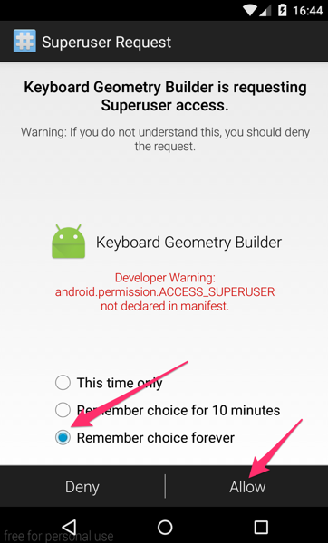
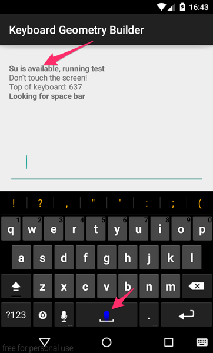
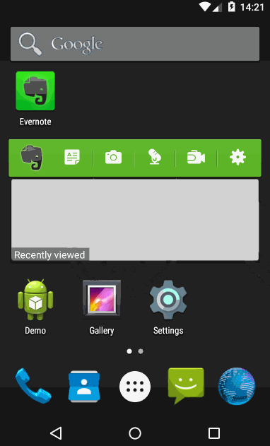

# Keyboard Geometry Builder and espresso action

## What is it?

The Keyboard Geometry Builder (kgb) is a test tool to help reduce the incidences of regression stemming from difficulties in correctly handling the wide variety of Android keyboards, and how they interact (in particular) with WebViews.

## Why is it needed?

Until now, automated testing has relied in injecting key events rather than actually stimulating the keyboard. This works better… but misses the majority of keyboard issues.

## Architecture

The kgb is composed of three parts:

* a client app, that can be run with minimal user input, and which uses heuristics to find the position of most keys on the keyboard, then uploads the key locations to a web service
* a web service, currently running as a Google Apps script, backed by a spreadsheet, stores the results of client runs, and can serve the best match for a given configuration to the test module
* the test module is integrated with the Espresso framework, and can be used to run the same or very similar tests that we currently run, but using keyboard stimulation rather than simulation

## How to run the builder

The builder app and espresso module are hosted as their own project. You can check it out and build it with Gradle.

Requirements:

* rooted device
* network access

The first time you run it, if your device is rooted, you should see a prompt like the one below. Allow root for ever to the app. If the Superuser request doesn’t come directly, you can open the Superuser or SuperSU app to help push it along…



The app then tries to find all the keys for the currently-configured keyboard (you should see a blue crawler where it tries to hit keys, and red dots where it finds them), and if it’s successful, it uploads the data.



If you have multiple keyboards installed on the device, the builder will iterate through them and upload all keyboard maps.

You can stop the app by tapping the X in the upper-right (not pictured).

## Usage

Add the following dependency to your Gradle config:

```groovy
dependencies {
    testCompile 'com.evernote:kgb:0.2.0'
}
```

## How to develop tests for it

Sample tests are in class `app/src/androidTest/java/com/evernote/keyboardgeometrybuilder/ApplicationTest.java`

## How to run tests

Requirements:
* Android 4.3 or rooted device (with Android 4.3, UiAutomator is used to inject taps on the keyboard and switching keyboards)
* network access

With Android 4.2 and earlier, the first time tests are run on a given device, root access must be granted to the application.

## How can I keep my keyboard maps separate from the shared data?

There is value in having a single shared repository for keyboard maps, but if you want to use a separate one:

* create a new Google Spreadsheet
* create a new macro, and paste the content of `kgb.gs` into it
* edit the macro to point to the spreadsheet
* publish the macro
* edit `com.evernote.espressokeyboard.KeyLocations.MACRO_ID` to point to the macro

## Limitations

* the builder can only run on a rooted device, and once the root privileges have been granted
keyboards have a lot of leeway, so tests may require more maintenance, as keyboards evolve and keys move
don’t expect exact results, in particular with casing: at the start of a line, the keyboard will want to use an uppercase letter, whereas using injected events type what you tell them to
* in particular, be aware that capitalizing the scheme of a URL (http) turns it into not-a-link…
* because the builder is based on automated heuristics, it may have trouble if the keyboard layout is too strange (split keyboards, keyboards requiring swipes, etc.)
* the system tries to account for different screen sizes and variations in density, fonts, navbar, etc, but it’s safer to run the builder on the same devices that will be running the tests (the requirements are the same)

## Demo

Disclaimer: there’s a long pause at the beginning… but then it goes on to test CE and NE with two different keyboards…



## License

    Copyright (c) 2007-2015 by Evernote Corporation, All rights reserved.

    Use of the source code and binary libraries included in this package
    is permitted under the following terms:

    Redistribution and use in source and binary forms, with or without
    modification, are permitted provided that the following conditions
    are met:

        1. Redistributions of source code must retain the above copyright
        notice, this list of conditions and the following disclaimer.
        2. Redistributions in binary form must reproduce the above copyright
        notice, this list of conditions and the following disclaimer in the
        documentation and/or other materials provided with the distribution.

    THIS SOFTWARE IS PROVIDED BY THE AUTHOR ``AS IS'' AND ANY EXPRESS OR
    IMPLIED WARRANTIES, INCLUDING, BUT NOT LIMITED TO, THE IMPLIED WARRANTIES
    OF MERCHANTABILITY AND FITNESS FOR A PARTICULAR PURPOSE ARE DISCLAIMED.
    IN NO EVENT SHALL THE AUTHOR BE LIABLE FOR ANY DIRECT, INDIRECT,
    INCIDENTAL, SPECIAL, EXEMPLARY, OR CONSEQUENTIAL DAMAGES (INCLUDING, BUT
    NOT LIMITED TO, PROCUREMENT OF SUBSTITUTE GOODS OR SERVICES; LOSS OF USE,
    DATA, OR PROFITS; OR BUSINESS INTERRUPTION) HOWEVER CAUSED AND ON ANY
    THEORY OF LIABILITY, WHETHER IN CONTRACT, STRICT LIABILITY, OR TORT
    (INCLUDING NEGLIGENCE OR OTHERWISE) ARISING IN ANY WAY OUT OF THE USE OF
    THIS SOFTWARE, EVEN IF ADVISED OF THE POSSIBILITY OF SUCH DAMAGE.

### Other licenses

Two files in this repo are licensed differently than the rest:

* [KeyboardSwitcher.java](espressokeyboard/src/main/java/com/evernote/espressokeyboard/KeyboardSwitcher.java) is licensed under the Mozilla Public License
* [SoftKeyboardStateHelper.java](app/src/main/java/com/evernote/keyboardgeometrybuilder/SoftKeyboardStateHelper.java) is licensed CC BY-SA 3.0, per Stack Overflow's default contributor license